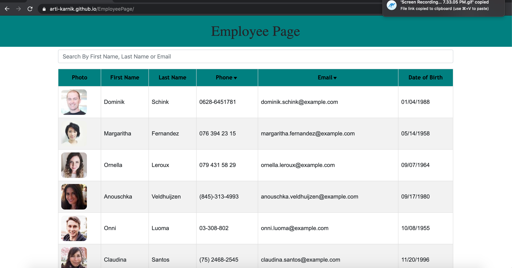

# EmployeePage
[EmployeePage](#EmployeePage)
    - [Table of Contents](#table-of-contents)
  * [Summary](#summary)
  * [UserStory](#UserStory)
  * [Description](#description)
  * [Pre-requisite](#pre-requisite)
  * [Demo](#demo)
  * [Technologyused](#technologyused-)
  * [Install](#install-)
  * [Contributor](#contributor)
  * [Codebase](#codebase)
  * [Application Walk-through](#Application-walk-through)

## Summary
Create a employee directory with React. This assignment will require you to break up your application's UI into components, manage component state, and respond to user events.

## UserStory

* As a user, I want to be able to view my entire employee directory at once so that I have quick access to their information.

## Description
An employee or manager would benefit greatly from being able to view non-sensitive data about other employees. It would be particularly helpful to be able to filter employees by name.

Given a table of random users generated from the [Random User API](https://randomuser.me/), when the user loads the page, a table of employees should render. 

## Pre-requisite
Install NodeJS  
Create React App

## Demo

## Technologyused:
<ul>
    <li> 
    <a href="https://reactjs.org/tutorial/tutorial.html" target="_blank">ReactJS <a>
</ul>

## Install:
$ cd <path>  
$ git clone https://github.com/arti-karnik/EmployeePage 

## Contributor
<strong> Github Profile: </strong>  
https://github.com/arti-karnik

<strong> Portfolio: </strong>  
https://arti-karnik.github.io/MyPortfolioPage/

## Codebase
https://github.com/arti-karnik/EmployeePage

## Application Walk-through
<a href="https://arti-karnik.github.io/EmployeePage/" target="_blank"> Click here for Application Live url </a>

